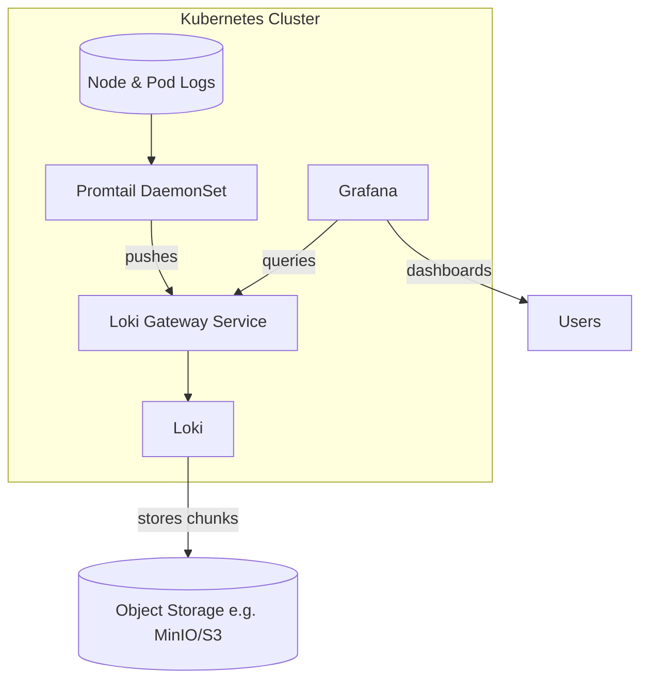

# Loki stack with Helm

Quick start for deploying Grafana, Loki, and Promtail to Kubernetes using the Grafana Helm charts.

## Architecture


## Prereqs
- Helm installed and configured to talk to your cluster
- Kubernetes namespace `loki` (created automatically below)

## Add the Grafana Helm repo
```bash
helm repo add grafana https://grafana.github.io/helm-charts
helm repo update
```

## Deploy Loki (using custom values)
```bash
helm upgrade -i loki grafana/loki \
  --version 6.49.0 \
  --create-namespace \
  --namespace loki \
  --values loki-values.yaml
```

## Deploy Promtail (using custom values)
```bash
helm upgrade -i promtail grafana/promtail \
  --version 6.17.1 \
  --namespace loki \
  --values promtail-values.yaml
```

## Deploy Grafana (using custom values)
```bash
helm upgrade -i grafana grafana/grafana \
  --version 10.3.1 \
  --namespace loki \
  --values grafana-values.yaml
```

Port-forward to the UI:
```bash
kubectl port-forward -n loki svc/grafana 3000:80
```
Login at http://localhost:3000 (user `admin`, password `admin`).

---

### Manual

## Deploy Grafana
```bash
helm upgrade -i grafana grafana/grafana \
  --version 10.3.1 \
  --create-namespace \
  --namespace loki \
  --set adminPassword='admin'
```

## Deploy Loki (single binary)
```bash
helm pull --untar grafana/loki
cd loki

helm upgrade -i loki grafana/loki \
  --version 6.49.0 \
  --namespace loki \
  -f single-binary-values.yaml
```

Loki API gateway:
```
http://loki-gateway.loki.svc.cluster.local/
```
Send requests with header `X-Scope-OrgID: loki`.

## Deploy Promtail
```bash
helm upgrade -i promtail grafana/promtail \
  --version 6.17.1 \
  --namespace loki \
  --set config."clients[0]".url="http://loki:3100/loki/api/v1/push" \
  --set config."clients[0]".tenant_id=loki
```
